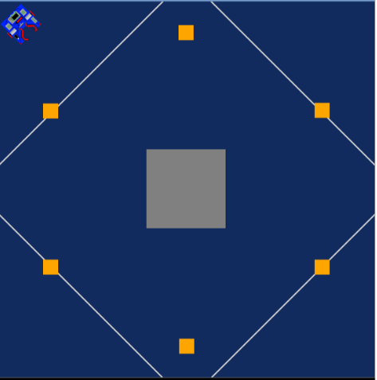
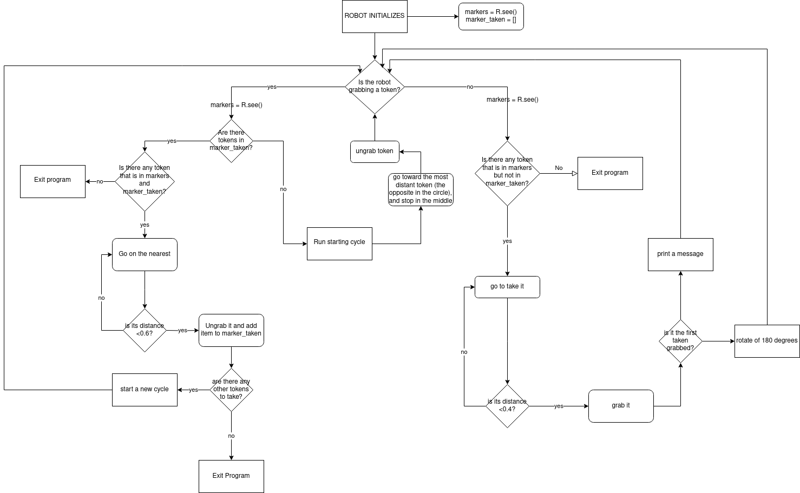

# Assignment 1: "The 6 boxes"

by leleviola

## Introduction

There are 6 golden boxes all positioned in circle around a gray region, as shown in figure, and a mobile robot with an end effector. The robot's characteristics are described in the README in robot-sim folder. 
The aim of the assignment is to bring all the boxes together grabbing them with the robot's end effector.

  

  Even if it wasn't requested, I did this so that the boxes are collected in the gray region. I thought that it was the smartest way to bring toghether all the boxes, because, doing this, the robot takes advantage of the fact that they are all placed in circle so it moves less (minimum Euclidean distance). 

  During the simuliation there will be two windows:
  - The turtle simulator, in which you can see the robot working;
  - Terminal, that displays messagges from the robot, and it is useful to better understand how it works.

## Steps and Flowchart

The main program is composed by the robot initialization, where are initialized the most important variables, and by a while loop. This while loop is splitted in two sections:

- the first that contains all the actions that the robot do, when isn't grabbing any token, in order to take the nearest and right token;

- the second one that makes the robot release the token in the right place and starts if and only if the robot is moving a token.

  All the reasonings and steps are described in the flowchart below.

  
  
  While markers is the variables that contains all the markers that the robot sees, marker_taken contains only the markers that are moved to the center. Doing this is easyer to determine wich of the markers that robot seen have been already moved and wich not.
  When the robot has to take a marker, it, using some function that will be described in the next section, checks if the token's distance is:
- =-1 => this means that the robot doesn't see any token;
- < a threshold value (0.4 or 0.6) => the robot grab/ungrab the token.
It also checks if the angle between the robot and the token is:
- -2 < angle < 2 => this means that the token is  straight in front of the robot so it has to toward it direction;
- > 2 => turn right a bit
- < -2 => turn left a bit

## Functions

For making coding simpler, I've used some useful functions.

### drive(speed, seconds)

Function for setting a linear velocity    
Args: 
  - speed (int): the speed of the wheels
  - seconds (int): the time interval
   
### turn(speed, seconds)

Function for setting an angular velocity    
Args: 
  - speed (int): the speed of the wheels
  - seconds (int): the time interval

### find_mindist_untaken_token(marker_list, marker_taken)

Function to find the closest token that is in marker_list and not in marker_taken
- Args:
  - marker_list(list): the list of all markers seen by the robot
  - marker_taken(list): the list of all the markers moved to the center
- Returns:
  - dist (float): distance of the closest token (-1 if no token is detected)
  - rot_y (float): angle between the robot and the token (-1 if no token is detected)
  - index (int): the index in marker_list of the token (-1 if no token is detected)

### find_mindist_taken_token(marker_list, marker_taken)

Function to find the closest token of tokens that are in marker_list and also in marker_taken
- Args:
  - marker_list(list): the list of all markers seen by the robot
  - marker_taken(list): the list of all the markers moved to the center
- Returns:
  - dist (float): distance of the closest token (-1 if no token is detected)
  - rot_y (float): angle between the robot and the token (-1 if no token is detected)
  - index (int): the index in marker_list of the token (-1 if no token is detected)
### find_maxdist_token(marker_list)
Function to find of the most distant token
- Args:
  - marker_list(list): the list of all markers seen by the robot

- Returns:
  - dist (float): distance (-1 if no token is detected)
  - rot_y (float): angle between the robot and the token (-1 if no token is detected)
  - index(int): the index of the element at max distance
 
### find_same_token(list, mark)
    
Function to determine if there is the token "mark" in the list of tokens "list".
- Args:
  - list(list): is the list where it will search the token "mark"
  - mark(Token): is the token to find
- Returns:
  - True if "mark" is in "list"
  - False if "mark" isn't in "list"

## Results and conclusions
